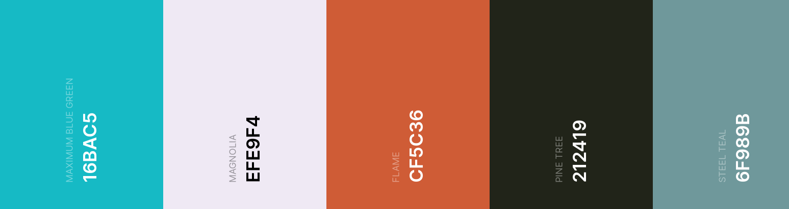

# ReactFromTheGroundUpDemo with Studio Ghibli

Link to API specs: https://ghibliapi.herokuapp.com/

### Color Palette 

This walk through will entail the creation of a three-page React application which will utilize the Studio Ghibli API to display data about movies allowing user's to choose their favorites and save them 

