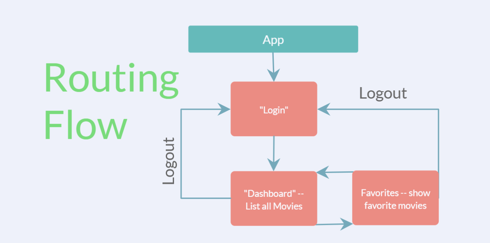

# ReactFromTheGroundUpDemo with Studio Ghibli

Link to API specs: https://ghibliapi.herokuapp.com/

### Color Palette 

     This walk through will entail the creation of a three-page React application which will utilize the Studio Ghibli API to display data about movies allowing user's to choose their favorites and save them. This should touch upon most of the concepts fundamental to using React (e.g routing, fetching data, managing state, styling, side effects.) as well as how to implement them correctly. Below is a visual of the routing flow for this application essential in what order we can access each page and from where. 

